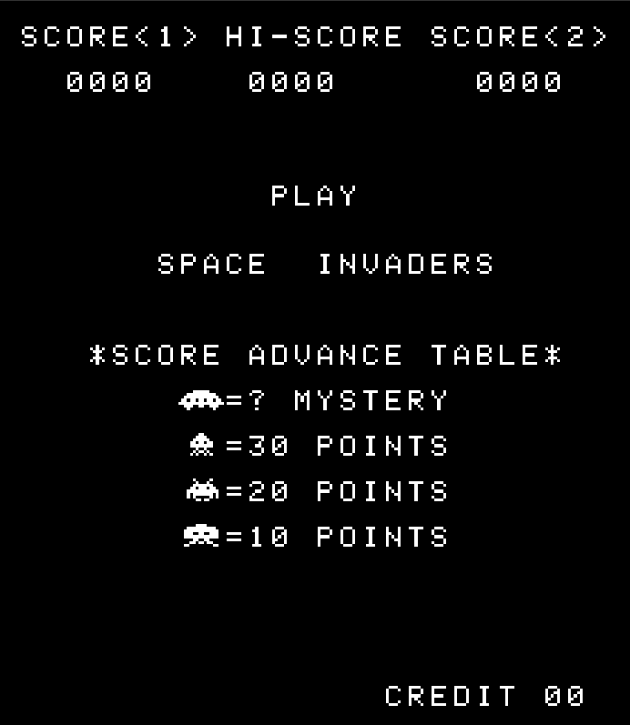
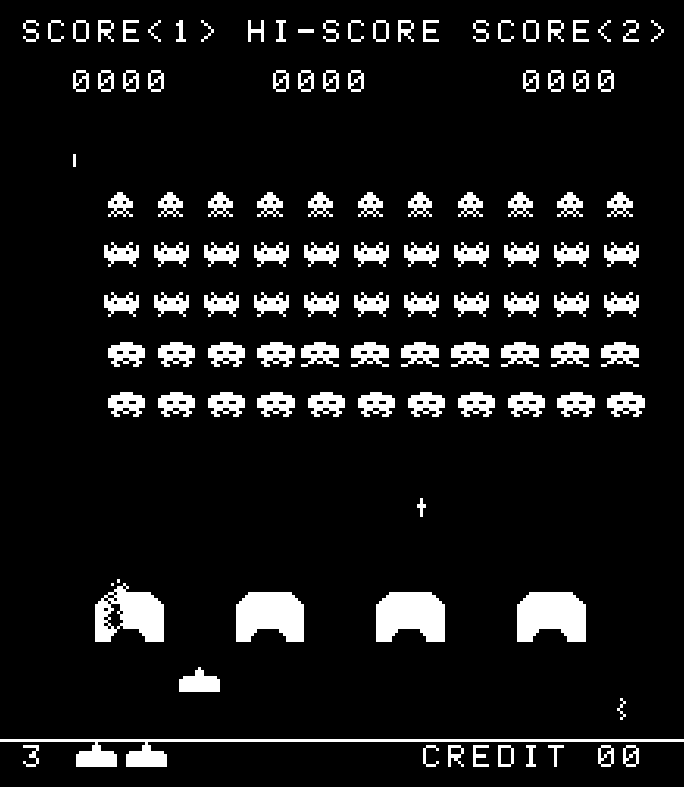

# Space Invaders arcade emulator
[Space invaders](https://en.wikipedia.org/wiki/Space_Invaders) emulator written in C++ and SFML(for the graphics)

## Notes
* although the emulator is written using C++, i wrote it in a C style, the only reason i used C++ is because SFML is way easier to use with it, nothing spectific to C++ is used but the calls to the SFML library API.
* color support is not implemented yet (duh).
* Sound support is not implemented too (duhX2).
* you need to get the Space invaders ROM yourself, just search online "mame space invaders ROM" and you will find it, you will also need to concatenate all the invaders.x files in this order: `invaders.h` `invaders.g` `invaders.f` `invaders.e`
* for two players mode you need to insert atleast 2 coins (dont worry they are free)

## compiling and running
* you need to have [SFML](https://www.sfml-dev.org/) installed in order to compile the code
* to compile the code simply run `make` in the project directory, that will spit out a binary file in the `bin/` directoy
* i used clang++ as my C++ compiler, if you want to use g++ or any other compiler just run `make CC=[your preffered compiler]` insteed 

## Controls 

| Button   | Space Invaders                                 |
| -------- | ---------------------------------------------- |
| C        | insert a coin                                  |
| 1        | start a game (one player only)                 | 
| 2        | start a game in two-player mode                |
| Left     | move P1 left                                   |
| Right    | move P1 right                                  |
| Up       | P1 Shoot                                       |
| A        | move P2 left                                   |
| D        | move P2 right                                  |
| W        | P2 Shoot                                       |

## resources
* you can find the resources i used for implementing the cpu in my [I8080 repo](https://github.com/ahumblescientist/I8080)
* [computerarcheology](https://computerarcheology.com) served as a great refrence in general about the machine
* [r/emudev](https://www.reddit.com/r/EmuDev/) and emudev discord server
